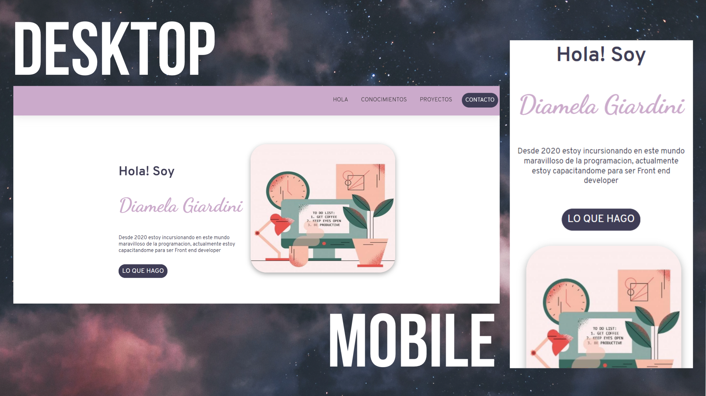

# Proyecto: *✨Portfolio✨*

Bienvenido/a a mi primer Wedsite personal realizado para el curso de Ada ITW donde aplico mis primeros conocimientos de HTML5, CSS3 y Maquetado con Flex 🙌

###Diseño responsivo 💻📱
Se adapta a Smartphone y Tablet

###Contenido
Esta dividido en secciones: 
- Presentación
- Mis Conocimientos
- Cita
- Mis Proyectos
- Medios de Contacto

Intento cumplir con la accesibilidad que todos los usuarios necesitan, sin embargo, aun estoy en proceso de aprendizaje sobre el tema asique se iran haciendo modificaciones a medida que vaya adquiriendo los conocimientos. 

📌 Deploy en Netlify: 
